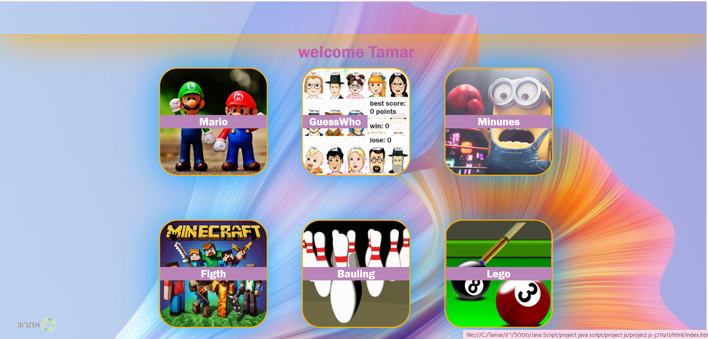
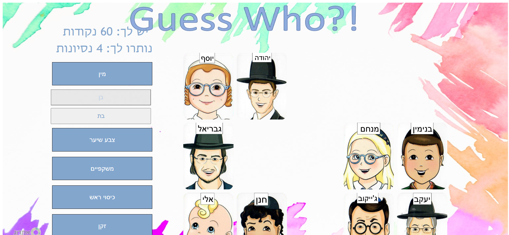
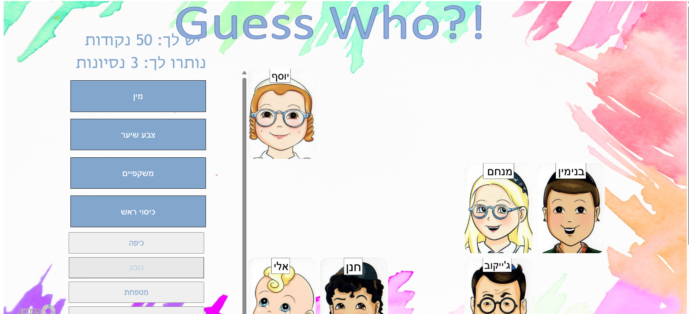
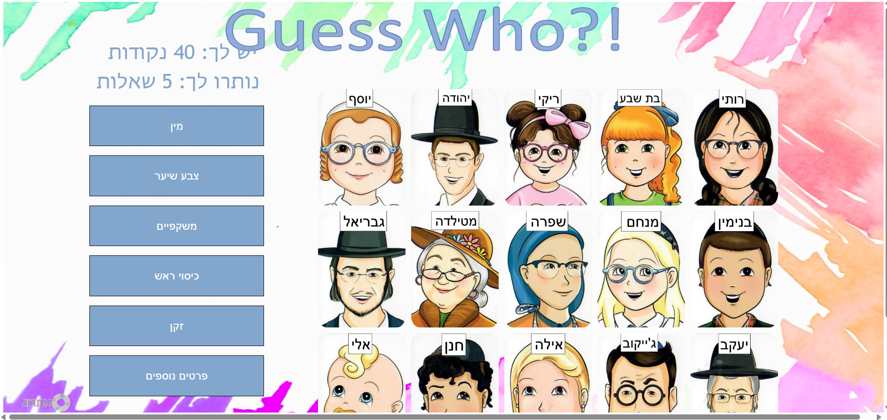

# 🎮 JavaScript Guess Who Game

An interactive and colorful Guess Who game built using HTML, CSS, and JavaScript.

---

## 📖 About The Project

This project is a browser-based Guess Who game developed as a front-end practice project.
Players can interact with different characters, ask questions, and try to guess the correct character through the gameplay process.

The project includes multiple screens, modern UI styling, and interactive game logic using JavaScript.

---

## ✨ Features

- Interactive Guess Who gameplay
- Multiple game screens
- Character selection board
- Responsive and colorful UI
- Dynamic game behavior using JavaScript
- Custom styling with CSS

---

## 🛠 Technologies Used

- HTML5
- CSS3
- JavaScript

---

## 📂 Project Structure

```text
javascript-guess-who-game/
│
├── css/
├── images/
├── js/
├── screenshots/
├── index.html
└── README.md
```

---

## 🚀 How To Run

1. Clone or download the repository
2. Open the project folder
3. Run `index.html` in your browser

---

## 📸 Screenshots

### Welcome Page


### Games Menu


### Gameplay Screen 1


### Gameplay Screen 2


### Game Board


---

## 👩‍💻 Author

Created by Tamar